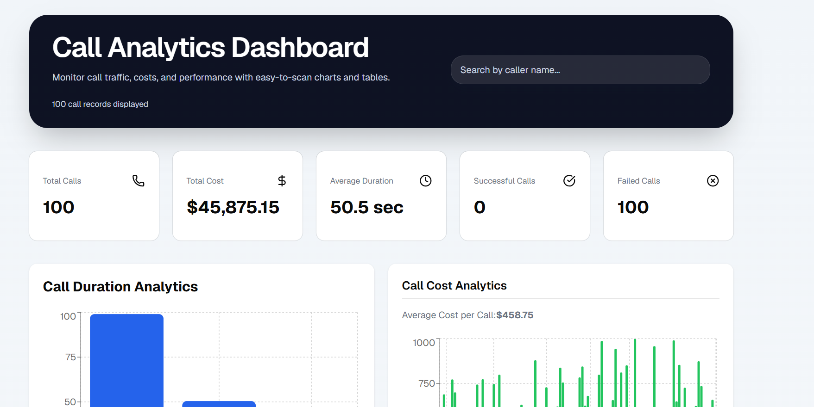
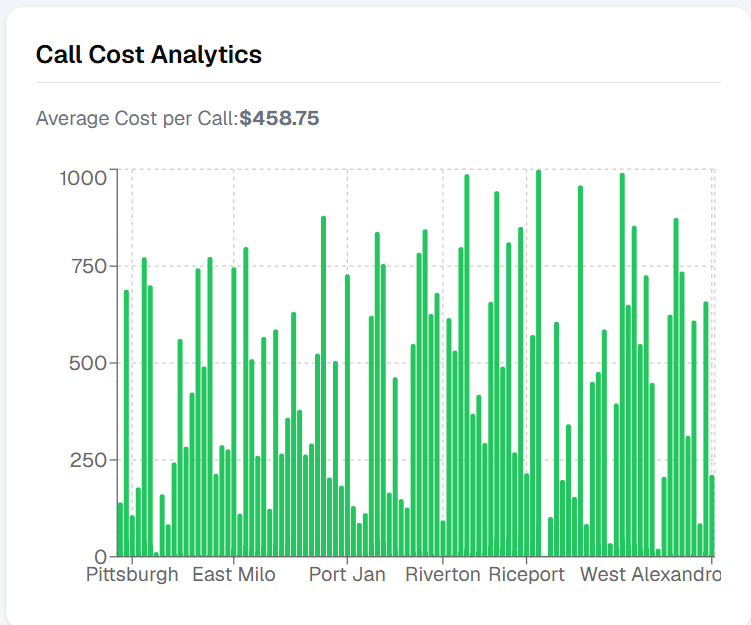

# Call Analytics Dashboard

A responsive React dashboard for visualizing call analytics, costs, and performance metrics using modern front-end tooling.

## Project Description

This dashboard displays:
- call volume and performance KPIs
- call duration analytics
- call cost breakdown by city
- call activity timeline
- recent call logs with search filtering

The app loads call detail records from a mock API and presents them with clean charts and tables.

## Technology Stack

- React 19
- Vite
- Tailwind CSS
- Recharts
- Axios
- ESLint

## Screenshots

> Replace these image paths with your real screenshots after exporting them.

### Dashboard Overview



### Call Cost and City Analytics



## Deployment

Live deployment link:

https://your-app-url.example.com

> Update the URL above with your actual deployment link.

## Getting Started

Install dependencies:

```bash
npm install
```

Start the development server:

```bash
npm run dev
```

Build for production:

```bash
npm run build
```

Preview the production build:

```bash
npm run preview
```

## Notes

- The dashboard uses the mock API at `https://69b30b45e224ec066bdb55a0.mockapi.io/api/v1/cdr`
- Update screenshot file paths and deployment URL once your app is published
